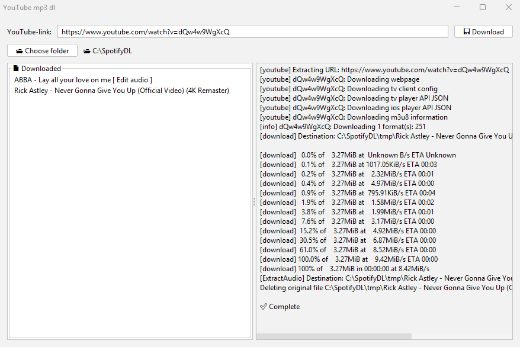

# 🎵 YouTube MP3 Downloader - Spotify local file unbugger


A simple, modern Java desktop application for downloading YouTube videos as `.mp3` files — perfect for **Spotify local files**. Built with `Swing`, supports real-time logs, history, and auto-folder updates.

---

## ✨ Features

- 🔗 Download MP3 audio from any YouTube URL
- 📂 Choose your own download folder (saved between runs)
- 📃 Real-time logs
- 🧠 Remembers downloaded songs
- 🧼 Automatically cleans up temporary files
- 🎧 Makes files Spotify-ready (forces update on filesystem)
- 💾 Saves to local disk in high quality `.mp3` format

---

## 🖼 UI Preview



---

## 🔧 Requirements

| Tool     | Version      |
|----------|--------------|
| Java     | 17 or later  |
| yt-dlp   | Latest stable (must be in PATH) |

Make sure `yt-dlp` is installed and available from the command line:

```bash
yt-dlp --version
